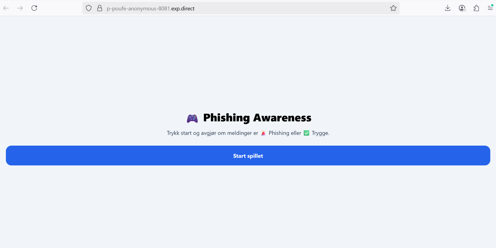
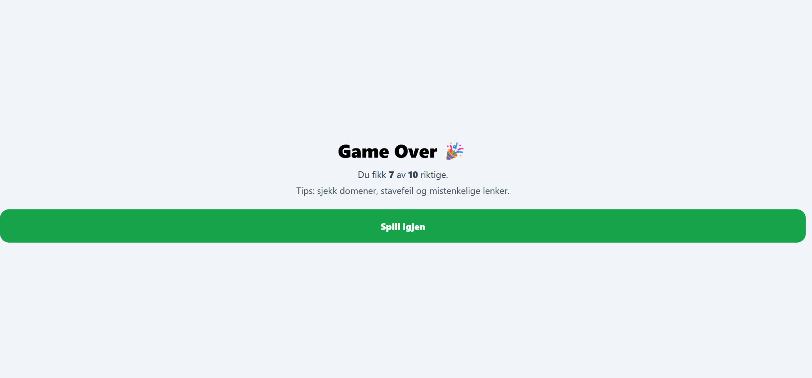
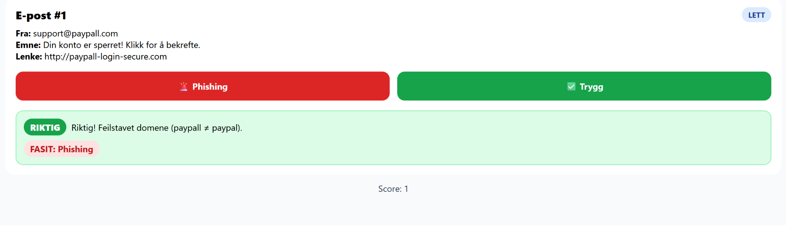
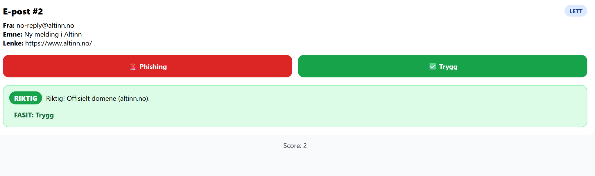
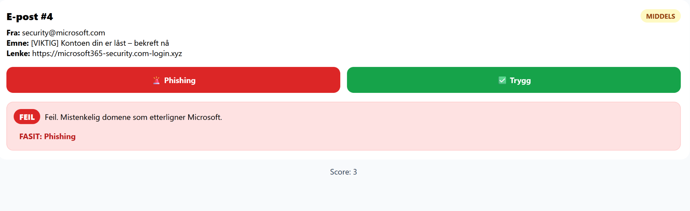
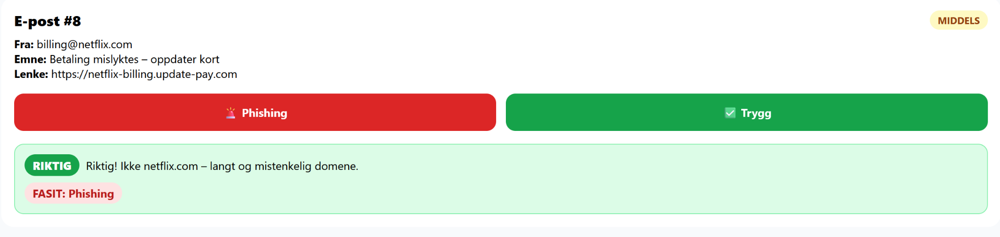

Phishing Awareness Game!
Dette prosjektet er et morsomt spill laget med React Native og Expo, som har som mål å trene brukere i å oppdage phishing-eposter. Når man starter spillet, får man opp eksempler på e-poster. Spilleren må deretter velge om meldingen er Phishing eller Trygg. Etter at man har svart på alle eksemplene, får man en slutt-score, og man kan spille igjen for å øve mer.

For å kjøre prosjektet lokalt må man først installere alle nødvendige avhengigheter ved å kjøre kommandoen npm install. Når dette er gjort kan spillet startes med kommandoen npx expo start. Expo åpner da et utviklingsmiljø der man kan kjøre appen i nettleser, eller skanne QR-koden i appen Expo Go på mobiltelefonen.

Prosjektet er bygget med React Native for å lage selve applikasjonen, Expo for å gjøre utviklingen enklere, og TypeScript for å få et mer robust og oversiktlig kodeoppsett.

Spillet er laget som et læringsprosjekt, men kan også brukes som en demo for å vise hvordan man kan kombinere programmering med opplæring i cybersikkerhet. Hensikten er både å vise frem tekniske ferdigheter og å skape et verktøy som øker bevisstheten rundt phishing-angrep.

Dette prosjektet er utviklet som en demo for å vise hvordan man kan kombinere app-utvikling med bevisstgjøring om IT-sikkerhet.
Målet er ikke å lage et ferdig produkt, men å demonstrere:

Ferdigheter i React Native, Expo og TypeScript.

Evnen til å strukturere kode i et moderne rammeverk.

Hvordan programmering kan brukes til å lage et engasjerende læringsverktøy.

Prosjektet er derfor ment som et eksempel til arbeidsgivere og samarbeidspartnere, slik at de kan se både teknisk kompetanse og kreativitet i praksis.

 

 

 

 

  

